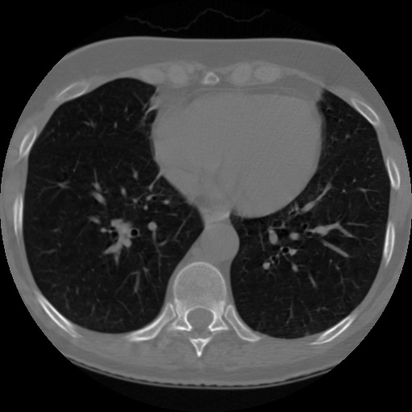
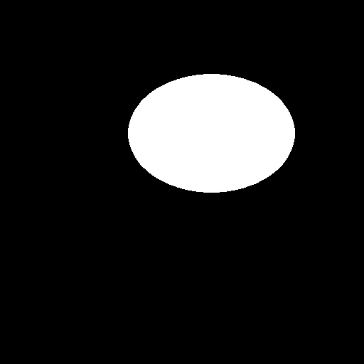
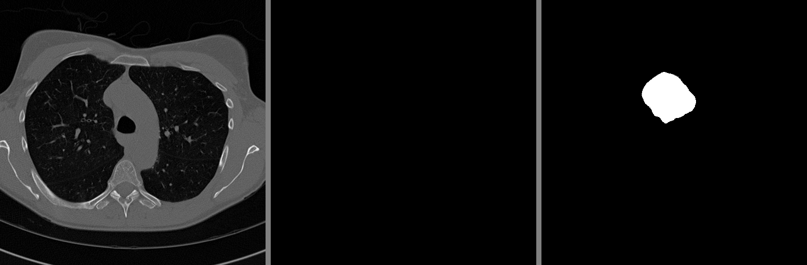
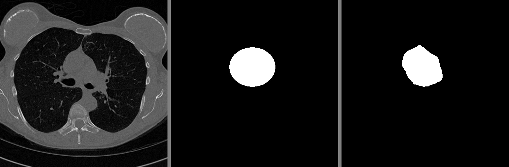
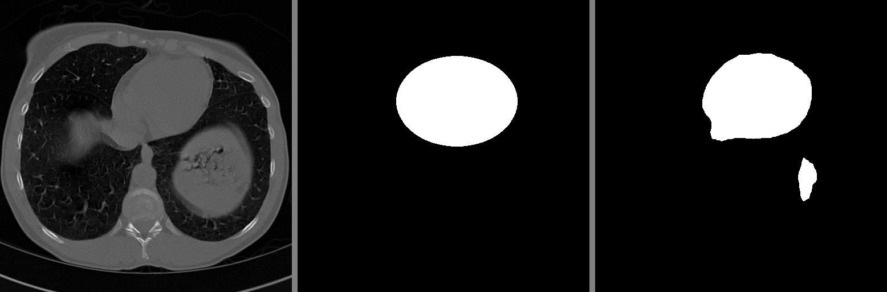

# UNET Segmentation on CT Scan Images in TensorFlow 2.0
The repository contains the code for UNET segmentation on CT scan dataset in TensorFlow 2.0 framework.

YouTube video: [UNET Segmentation on CT Scan Images using TensorFlow 2.0](https://youtu.be/xIvmg4IqeIk)

# Overview
- Dataset
- Architecture
- Results
- Contact

# Dataset
The dataset contains the CT scan image and their respective binary mask. These binary mask are annotated using VGG Image Annotator website.

Download the dataset: [CT Heart Dataset - 2D Binary Segmentation Task](https://kaggle.com/dataset/f41e0bab640002775b00e050b81a1144786324951b0576f5d71fd820d6ef13dc)
Original Image             |  Mask Image
:-------------------------:|:-------------------------:
  |  

# Architecture
The block diagram of the UNET architecture taken from the original paper.

|  |
| :--: |
| *U-Net Architecture* |

# Results
The images below contains:
1. Input image
2. Ground truth 
3. Predicted mask

|  |
| :--: |
|  |
|  |
|  |

## Contact
For any query contact below:
- [Facebook](https://www.facebook.com/idiotdeveloper)
- [Instagram](https://www.instagram.com/nikhilroxtomar/)
- [Telegram](https://t.me/idiotdeveloper)
